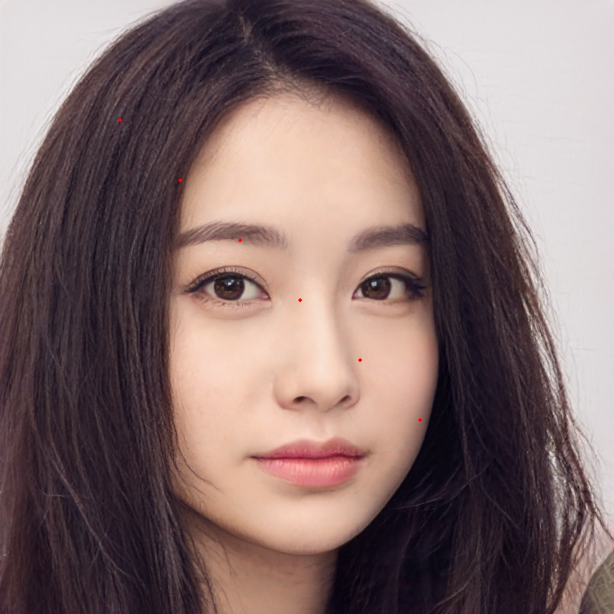

# drawing with cv2

## dots

use ``` draw_dots(p: StrOrArray,points: List[tuple],color: tuple = (0, 0, 255,),thickness: int = 4,pointSize: int = 1) ``` to draw dots in a image. 

param ```p``` is the image location or an image
param ```points``` a list of tuple, the location of points 
param ```color``` a tuple of ```BGR``` values( not ```RGB```,but ```BGR```in opencv),such as (0,0,255) means color is red  
param ```thickness``` border thickness
param ```pointSize``` point size

### eg.
```python
result = draw_dots("D:\\github_repo\\simple-cv-demos\\static\\0.png",
                   points=[(200, 200), (300, 300), (400, 400), (500, 500),
                           (600, 600), (700, 700)])
```

|  origin   | drawn image  |
|  ----  | ----  |
|   |  |